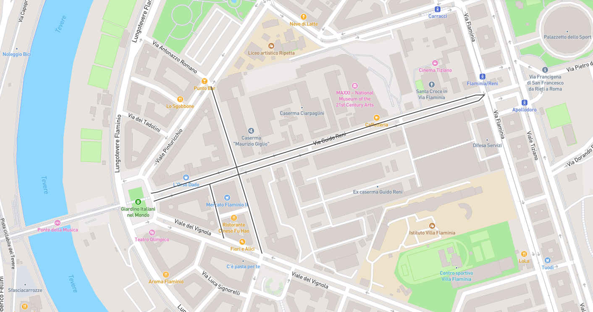

# OverPassAPI

This library performs overpass queries to extract geographic geometries in GeoJSon from OpenStreetMap.

## [Install](https://www.nuget.org/packages/OverPassAPI/)

```bash
dotnet add package OverPassAPI --version 1.0.6
```

## Usage
It is necessary to define the perimeter to perform the search with the coordinates in the EPSG:4326 (WGS84) reference system. For example, if we want to take a trip to Rome among the places of worship and know the mapped places where to stay

```C#

using OverPass;

string BBox = "41.926785246437,12.462970018387,41.927633354446,12.464384883642"; // Rome

Dictionary<string, List<string>>? Query = new()
{
    { "highway", new List<string>() { "residential" } },
    { "amenity", new List<string>() { "place_of_worship" } },
    { "religion", new List<string>() { "christian", "jewish" } },
    { "tourism", new List<string>() { "bed_and_breakfast", "hotel" } }
};

````

### Run By Query

```C#

// FeatureCollection Class
NetTopologySuite.Features.FeatureCollection? featuresAll = new OverPassAPI(BBox, Query).FeatureCollection;

// or GeoJSon serialized string
string? GeoJSon = new OverPassAPI(BBox, Query).GeoJSon;

```



### Run By All Tags

If no query is initialized the tags with the value * are considered for all classes, like this:

| TagKeys  | TagKeys |
|----------|:-------:|
| building | * |
| landuse | * |
| natural | * |
| leisure | * |
| boundary | * |
| place | * |
| amenity | * |
| religion | * |
| denomination | * |
| office | * |
| sport | * |
| shop | * |
| tourism | * |
| tourist | * |
| man_made | * |
| emergency | * |
| highway | * |
| railway | * |
| aerialway | * |
| waterway | * |
| military | * |
| aeroway | * |

**Disclaimer: Processing may take a few minutes depending on your region**

```C#

using OverPass;

string BBox = "41.926785246437,12.462970018387,41.927633354446,12.464384883642"; // Rome

// FeatureCollection Class
NetTopologySuite.Features.FeatureCollection? featuresAll = new OverPassAPI(BBox, Query).FeatureCollection;

// or GeoJSon serialized string
string? GeoJSon = new OverPassAPI(BBox).GeoJSon;
```

## Run By Geometry

It is possible to filter OpenStreetMap data by setting a GeoJSon Geometry as a parameter.
The result will be included in the geometry intersection with the geometry filter set.

```C#

using OverPass;
using OverPass.Utility;

string geometry = "{\"type\": \"Polygon\",\"coordinates\": " +
                  "[[[7.321217387935907,45.71137875194013]," +
                  "[7.325801094114396,45.71137875194013],[7.325801094114396,45.71457268228047]," +
                  "[7.321217387935907,45.71457268228047],[7.321217387935907,45.71137875194013]]]}";

Dictionary<string, List<string>>? Query = new()
{
    { "highway", new List<string>() { "track", "residential", "tertiary", "path" } }
};

OverPassAPI OApi = new(OverPassUtility.DeSerializeGeometry(geometry), Query, true);
string geojson = OApi.GeoJSon;

```

## Buffer

If you want to read geometries with a buffer of **X** meters, the *OverPassBuffer* class exists.

```C#

using OverPass;

string BBox = "41.926785246437,12.462970018387,41.927633354446,12.464384883642"; // Rome

Dictionary<string, List<string>>? Query = new()
{
    { "highway", new List<string>() { "residential" } },
    { "amenity", new List<string>() { "place_of_worship" } },
    { "religion", new List<string>() { "christian", "jewish" } },
    { "tourism", new List<string>() { "bed_and_breakfast", "hotel" } }
};

OverPassBuffer OApiBuffer = new(BBox, 10.0, Query);
string GeoJson = OApiBuffer.GeoJSon;

```


## Custom OpenStreetMap Server

You can configure your own OpenStreetMap [data extraction](http://download.geofabrik.de) server instead of https://overpass-api.de/api/interpreter 

For example to configure a container with a part of OSM:

```yaml

version: '3.8'

services:
    overpass:
        image: wiktorn/overpass-api
        mem_reservation: 2G
        restart: always
        container_name: overpass
        environment:
            OVERPASS_PLANET_URL: http://download.geofabrik.de/europe/italy/italy-latest.osm.pbf
            OVERPASS_DIFF_URL: http://download.openstreetmap.fr/replication/europe/italy/minute/
            PGPORT: 5433
        ports:
            - "8082:80"
            - "5433:5432"
        volumes:
            - ./data/overpass:/db

```
After starting the container, you can use one of the constructors to set the address of the new server and get better performance
```C#
string? GeoJSon = new OverPassAPI(BBox, Query, "http://locahost:8082").GeoJSon;
```

## Tags

The [OpenStreetMap (OSM) project](www.openstreetmap.org) has collected an enormous amount of free spatial data and the database is growing every day. Many people want to use this data for their own GIS projects but have been hindered by the use of a non-standard data format in the OSM project. 
**All coordinates are unprojected [WGS84 (EPSG:4326)](https://epsg.io/4326)**

OverPassAPI Class to has classes to query OpenStreetMap data mapped according to the Tags to be used for OverPass:

```C#

string BBox = "41.926785246437,12.462970018387,41.927633354446,12.464384883642"; // Rome
OverPassAPI OApi = new OverPassAPI(BBox)

/** Points */
if (OApi.Places != null)
{
    List<string>? k = OApi.Places.TagKeys;
    List<string>? v = OApi.Places.TagKeys;
}

if (OApi.PoI != null)
{
    List<string>? k = OApi.PoI.TagKeys;
    List<string>? v = OApi.PoI.TagValues;
}

if (OApi.PoFW != null)
{
    List<string>? k = OApi.PoFW.TagKeys;
    List<string>? v = OApi.PoFW.TagValues;
}

if (OApi.Natural != null)
{
    List<string>? k = OApi.Natural.TagKeys;
    List<string>? v = OApi.Natural.TagValues;
}

if (OApi.Traffic != null)
{
    List<string>? k = OApi.Traffic.TagKeys;
    List<string>? v = OApi.Traffic.TagValues;
}

if (OApi.Transport != null)
{
    List<string>? k = OApi.Transport.TagKeys;
    List<string>? v = OApi.Transport.TagValues;
}

/** LineString */
if (OApi.Roads != null)
{
    List<string>? k = OApi.Roads.TagKeys;
    List<string>? v = OApi.Roads.TagValues;
}

if (OApi.Railways != null)
{
    List<string>? k = OApi.Railways.TagKeys;
    List<string>? v = OApi.Railways.TagValues;
}

if (OApi.Waterways != null)
{
    List<string>? k = OApi.Waterways.TagKeys;
    List<string>? v = OApi.Waterways.TagValues;
}

/** Polygons */
if (OApi.Buildings != null)
{
    List<string>? k = OApi.Buildings.TagKeys;
    List<string>? v = OApi.Buildings.TagValues;
}

if (OApi.Landuse != null)
{
    List<string>? k = OApi.Landuse.TagKeys;
    List<string>? v = OApi.Landuse.TagValues;
}

if (OApi.Water != null)
{
    List<string>? k = OApi.Water.TagKeys;
    List<string>? v = OApi.Water.TagValues;
}

```

### Buildings

| TagKeys  | TagKeys |
|----------|:-------:|
| building | * | 

### Landuse

| TagKeys  | TagKeys |
|----------|:-------:|
| landuse  | forest | 
| natural  | wood | 
| leisure  | park | 
| leisure  | common | 
| landuse  | residential | 
| landuse  | industrial | 
| landuse  | cemetery | 
| landuse  | allotments | 
| landuse  | meadown | 
| landuse  | commercial | 
| leisure  | nature_reserve | 
| leisure  | recreation_ground | 
| leisure  | retail | 
| landuse  | military | 
| landuse  | quarry | 
| landuse  | orchad | 
| landuse  | vineyard | 
| landuse  | scrub | 
| landuse  | grass | 
| natural  | health | 
| boundary | national_park | 
| landuse  | farmland | 
| landuse  | farmyard | 

### NATURAL

| TagKeys  | TagKeys |
|----------|:-------:|
| natural  | spring | 
| natural  | glacier | 
| natural  | peak | 
| natural  | cliff | 
| natural  | volcano | 
| natural  | tree | 
| natural  | mine | 
| natural  | cave_entrance | 
| natural  | beach | 

### PLACES

Location for cities, towns, etc. Typically somewhere in the centre of the town.

| TagKeys  | TagKeys |
|----------|:-------:|
| place    | city |
| place    | town |
| place    | village |
| place    | hamlet |
| place    | suburb |
| place    | island |
| place    | farm |
| place    | isolated_dwelling |
| place    | region |
| place    | county |
| place    | locality |

#### Additional attributes:

- **population=x** INTEGER Number of people living in this place (population=* Default Value)
*Note: Note that for many places the population is not available and will be set to 0. For islands the population is always 0.*

- To a **national capital** use *place=city* with *is_capital=country* or *admin_level=2* or *capital=yes* and no admin_level set

### POFW (Places of Worship)

| TagKeys  | TagKeys |
|----------|:-------:|
| amenity | place_of_worship | 
| religion | christian | 
| religion | jewish | 
| religion | muslim | 
| religion | buddhist | 
| religion | hindu | 
| religion | taoist | 
| religion | shintoist | 
| religion | sikh | 
| denomination | anglican | 
| denomination | catholic | 
| denomination | evangelical | 
| denomination | lutheran | 
| denomination | methodist | 
| denomination | orthodox | 
| denomination | protestant | 
| denomination | baptist | 
| denomination | mormon | 
| denomination | sunni | 
| denomination | shia | 

### POI (Points of Interest)

| TagKeys  | TagKeys |
|----------|:-------:|
| amenity | police |
| amenity | fire_station |
| amenity | post_office |
| amenity | telephone |
| amenity | library |
| amenity | townhall |
| amenity | courthouse |
| amenity | prison |
| amenity | embassy |
| office | diplomatic |
| amenity | community_centre |
| amenity | nursing_home |
| amenity | arts_centre |
| amenity | grave_yard |
| landuse | cemetery |
| amenity | marketplace |
| amenity | university |
| amenity | school |
| amenity | kindergarten |
| amenity | college |
| amenity | public_building |
| amenity | pharmacy |
| amenity | hospital |
| amenity | doctors |
| amenity | dentist |
| amenity | veterinary |
| amenity | theatre |
| amenity | nightclub |
| amenity | cinema |
| leisure | park |
| leisure | playground |
| leisure | dog_park |
| leisure | sports_centre |
| leisure | pitch |
| amenity | swimming_pool |
| leisure | swimming_pool |
| sport | swimming |
| leisure | water_park |
| sport | tennis |
| leisure | golf_course |
| leisure | stadium |
| leisure | ice_rink |
| amenity | restaurant |
| amenity | fast_food |
| amenity | cafe |
| amenity | pub |
| amenity | bar |
| amenity | food_court |
| amenity | biergarten |
| tourism | hotel |
| tourism | motel |
| tourism | bed_and_breakfast |
| tourism | guest_house |
| tourism | hostel |
| tourism | chalet |
| amenity | shelter |
| tourism | camp_site |
| tourism | alpine_hut |
| tourism | caravan_site |
| shop | supermarket |
| shop | bakery |
| shop | kiosk |
| shop | mall |
| shop | department_store |
| shop | general |
| shop | convenience |
| shop | clothes |
| shop | florist |
| shop | chemist |
| shop | books |
| shop | butcher |
| shop | shoes |
| shop | alcohol |
| shop | beverages |
| shop | optician |
| shop | jewerly |
| shop | gift |
| shop | sports |
| shop | stationery |
| shop | outdoor |
| shop | mobile_phone |
| shop | toys |
| shop | newsagent |
| shop | greengrocer |
| shop | beauty |
| shop | video |
| shop | car |
| shop | bicycle |
| shop | doityourself |
| shop | hardware |
| shop | furniture |
| shop | computer |
| shop | garden_centre |
| shop | hairdresser |
| shop | car_repair |
| amenity | car_rental |
| amenity | car_wash |
| amenity | car_sharing |
| amenity | bicycle_rental |
| amenity | travel_agency |
| amenity | laundry |
| amenity | dry_cleaning |
| shop | travel_agency |
| shop | laundry |
| shop | dry_cleaning |
| amenity | vending_machine |
| amenity | bank |
| amenity | atm |
| tourist | information |
| tourist | attraction |
| historic | monument |
| historic | memorial |
| tourist | artwork |
| historic | castle |
| historic | ruins |
| historic | archaeological_site |
| historic | wayside_criss |
| historic | wayside_shrine |
| historic | battlefield |
| historic | fort |
| tourism | picnic_site |
| tourism | viewpoint |
| tourism | zoo |
| tourism | theme_park |
| amenity | toilets |
| amenity | bench |
| amenity | drinking_water |
| amenity | fountain |
| amenity | hunting_stand |
| amenity | waste_basket |
| man_made | surveillance |
| amenity | emergency_phone |
| emergency | phone |
| amenity | fire_hydrant |
| highway | emergency_access_point |
| man_made | tower |

### RAILWAYS

| TagKeys  | TagKeys |
|----------|:-------:|
| railway | rail | 
| railway | light_rail | 
| railway | subway | 
| railway | tram | 
| railway | monorail | 
| railway | narrow_gauge | 
| railway | miniature | 
| railway | funicular | 
| railway | rack | 
| aerialway | drag_lift | 
| aerialway | chair_lift | 
| aerialway | cable_car | 
| aerialway | gondola | 
| aerialway | goods | 

### ROADS

| TagKeys  | TagKeys |
|----------|:-------:|
| highway | motorway | 
| highway | trunk | 
| highway | primary | 
| highway | secondary | 
| highway | tertiary | 
| highway | unclassified | 
| highway | residential | 
| highway | living_street | 
| highway | pedestrian | 
| highway | busway | 
| highway | motorway_link | 
| highway | trunk_link | 
| highway | primary_link | 
| highway | secondary_link | 
| highway | tertiary_link | 
| highway | service | 
| highway | track | 
| highway | bridleway | 
| highway | cycleway | 
| highway | footway | 
| highway | path | 
| highway | steps | 

### TRAFFIC

| TagKeys  | TagKeys |
|----------|:-------:|
| highway | traffic_signals |
| highway | mini_roundabou |
| highway | stop |
| highway | crossing |
| highway | level_crossing |
| highway | ford |
| highway | motorway_junction |
| highway | turning_circle |
| highway | speed_camera |
| highway | street_lamp |
| amenity | fuel |
| highway | services |
| amenity | park |
| highway | bicycle_parking |
| leisure | slipway |
| leisure | marina |
| man_made | pier |
| waterway | dam |
| waterway | waterfall |
| waterway | lock_gate |
| waterway | weir |

### TRANSPORT

| TagKeys  | TagKeys |
|----------|:-------:|
| railway | station | 
| railway | halt | 
| railway | tram_stop | 
| highway | bus_stop | 
| amenity | bus_station | 
| amenity | taxi | 
| amenity | airport | 
| amenity | airfield | 
| military | airfield | 
| aeroway | helipad | 
| aeroway | apron | 
| amenity | ferry_terminal | 
| aerialway | station | 

### WATER

| TagKeys  | TagKeys |
|----------|:-------:|
| natural | water | 
| landuse | reservoir | 
| waterway | riverbank | 
| waterway | dock | 
| natural | glacier | 
| natural | wetland | 

### WATERWAYS

| TagKeys  | TagKeys |
|----------|:-------:|
| waterway |  river |
| waterway |  stream |
| waterway |  canal |
| waterway |  drain |
